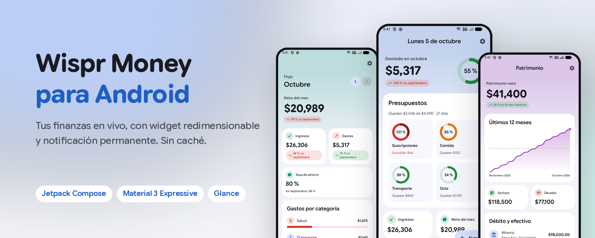
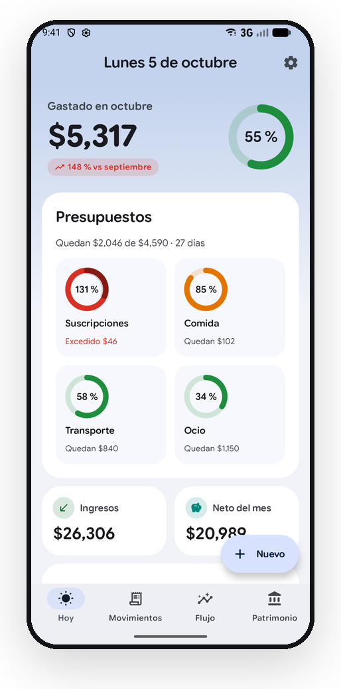
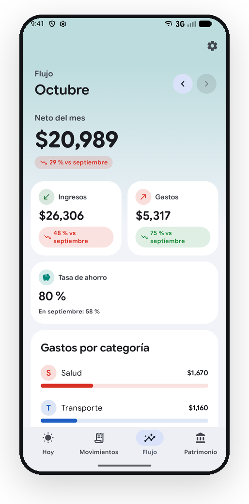
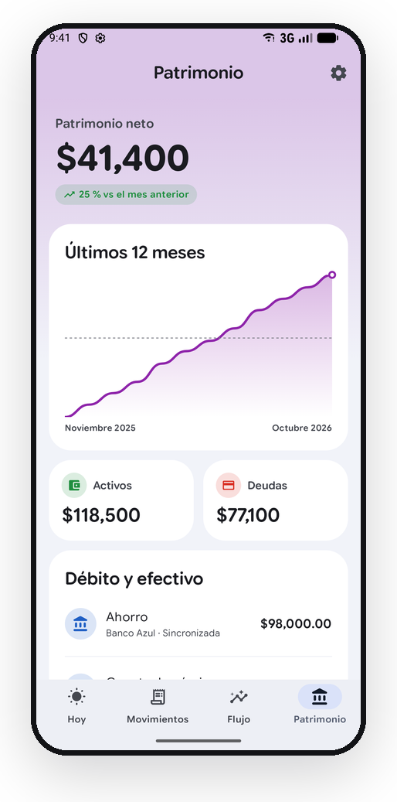
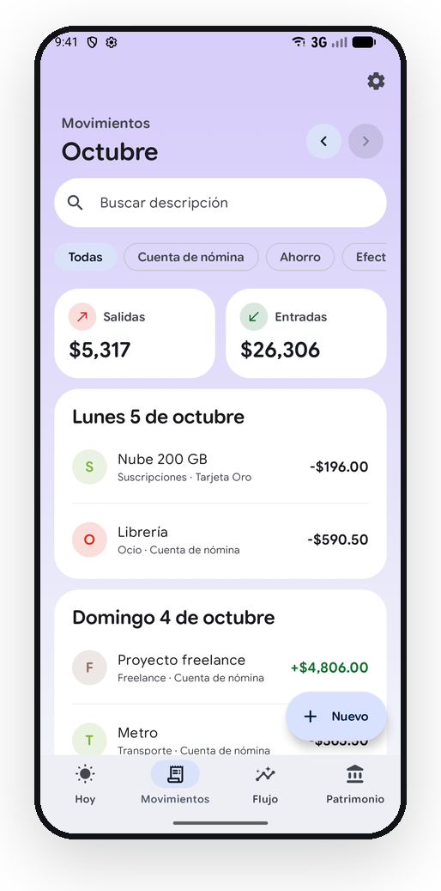
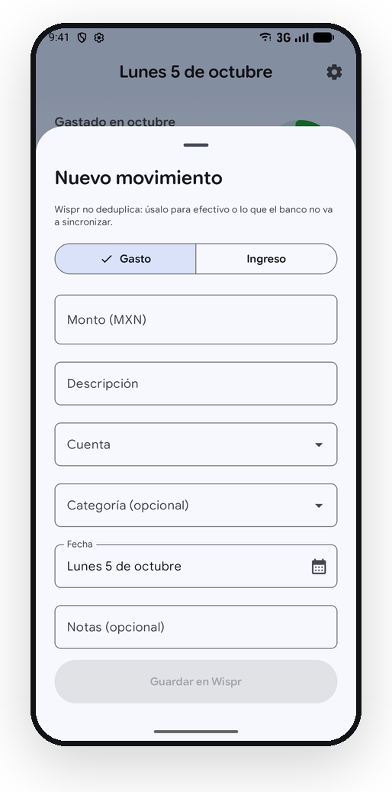
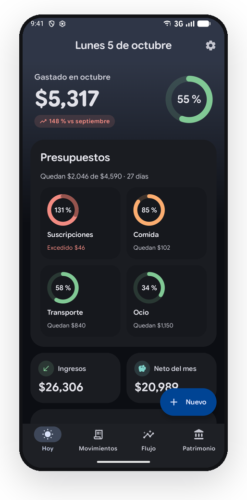
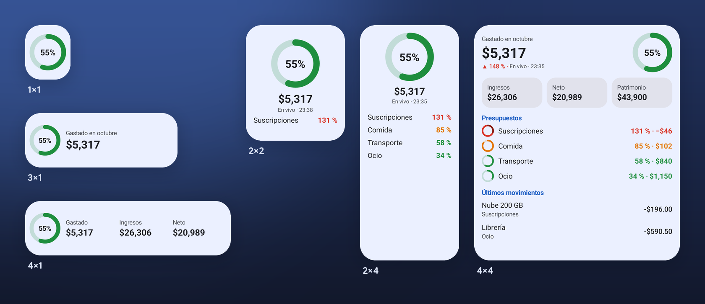
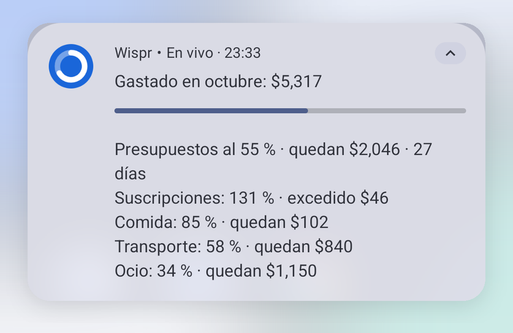
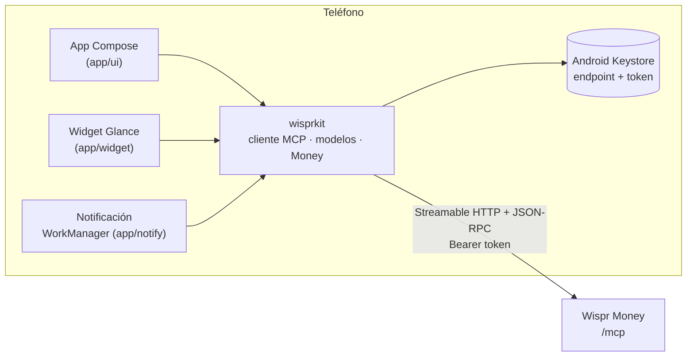

<div align="center">



# Wispr Money para Android

**App nativa de Android, widget redimensionable y notificación permanente para [Wispr Money](#qué-es-wispr-money) self-hosted.**
Kotlin + Jetpack Compose con Material 3 Expressive, sin web views y sin caché: cada cifra se pide en vivo a tu servidor.

[](https://github.com/Chere3/wispr-money-android/actions/workflows/ci.yml)
[](#requisitos)
[](https://kotlinlang.org)
[](#diseño)
[](#widget)
[](LICENSE)

[Pantallas](#pantallas) · [Widget](#widget) · [Notificación](#notificación-permanente) · [Principios](#principio-nada-pre-cacheado) · [Instalar](#instalar) · [Arquitectura](#arquitectura) · [Contribuir](#contribuir)

</div>

> [!NOTE]
> **In English:** a native Android client, resizable home-screen widget and ongoing notification
> for self-hosted Wispr Money. Kotlin + Jetpack Compose (Material 3 Expressive) + Glance, talking
> straight to the server's MCP endpoint (Streamable HTTP + JSON-RPC). No web views, no cache:
> every number is fetched live, and if a request fails you see the error, never stale figures.
> The UI is in Spanish; contributions in English are welcome.

> [!IMPORTANT]
> Cliente **no oficial**, hecho por la comunidad. No está afiliado ni respaldado por Wispr Money.
> Hermano de [Wispr Money para Mac](https://github.com/Chere3/wispr-money-mac).

## Por qué

Wispr Money vive en el navegador. Esta app lo trae al teléfono como una app de Android de verdad:
lo gastado en el mes en la pantalla de inicio, en la barra de notificaciones y a un toque. Todo se
consulta en vivo por MCP, el mismo endpoint que usan los asistentes de IA, así que no hay backend
extra ni base de datos local.

## Pantallas

<table>
  <tr>
    <td width="33%"></td>
    <td width="33%"></td>
    <td width="33%"></td>
  </tr>
  <tr>
    <td><b>Hoy</b>: lo gastado en el mes contra el anterior, anillos de presupuestos (al pasar del 100 % dan una segunda vuelta), ingresos, neto y últimos movimientos.</td>
    <td><b>Flujo</b>: neto, ingresos, gastos y tasa de ahorro contra el mes anterior, gasto por categoría con subcategorías y los últimos 6 meses.</td>
    <td><b>Patrimonio</b>: total contra el mes anterior, evolución de 12 meses, activos, deudas y saldo de cada cuenta.</td>
  </tr>
  <tr>
    <td></td>
    <td></td>
    <td></td>
  </tr>
  <tr>
    <td><b>Movimientos</b>: por mes, con búsqueda y filtro por cuenta, agrupados por día.</td>
    <td><b>Alta manual</b>: gasto o ingreso, cuenta, categoría, fecha y notas. Se guarda directo en Wispr.</td>
    <td><b>Tema oscuro</b> automático, con el mismo semáforo de colores.</td>
  </tr>
</table>

<sub>Todas las capturas usan datos sintéticos del servidor de demostración (`scripts/demo_server.py`).</sub>

| Pestaña | Herramientas MCP |
|---|---|
| Hoy | `list_budgets`, `get_cashflow`, `search_transactions` |
| Movimientos (+ alta) | `search_transactions`, `create_transaction`, `list_accounts`, `list_categories` |
| Flujo | `get_cashflow`, `spending_by_category` |
| Patrimonio | `get_net_worth`, `list_accounts` |

Desliza hacia abajo en cualquier pantalla para volver a consultar.

## Widget



Un solo widget que se redimensiona de 1×1 a pantalla completa: **cuanto más grande, más muestra**.

| Tamaño | Muestra |
|---|---|
| 1×1 | anillo del total de presupuestos |
| 2–3×1 | anillo + gastado del mes |
| 4×1 | anillo + gastado, ingresos y neto |
| 2×2 | anillo, gastado, hora y el presupuesto más apretado |
| 1–2×3 o más | + lista de presupuestos, tantos como quepan |
| 3–4×2 | gastado, variación contra el mes anterior, anillo y presupuestos |
| 4×3 o más | + ingresos, neto y patrimonio, presupuestos con anillo y últimos movimientos |

Semáforo: verde < 80 %, naranja 80–100 %, rojo pasado el 100 %. En el selector de widgets
(Android 15+) la vista previa se genera con datos sintéticos.

## Notificación permanente



Silenciosa, en el canal "Gasto del mes": lo gastado, el % de presupuestos, lo que queda, los días
que faltan y el detalle de cada presupuesto. Se actualiza cada ~15 min. Desde Android 14 cualquier
notificación se puede deslizar; si lo haces, la app vuelve a consultar y la republica. En la
pantalla de bloqueo no muestra cifras.

## Principio: nada pre-cacheado

- Cada pantalla consulta al servidor al abrirse, al volver a la app y al deslizar hacia abajo, y
  muestra a qué hora fue la consulta.
- OkHttp sin caché, con `no-cache`/`no-store` en cada request.
- Si una consulta falla se muestra el error, nunca los números de la consulta anterior.
- Lo único que se guarda en el teléfono es el endpoint y el token, cifrados con AES-GCM y una clave
  no exportable del Android Keystore.

**Límite de Android:** el widget y la notificación son "fotos" que el sistema conserva hasta la
siguiente. Aquí cada foto se pide en vivo (WorkManager, ~15 min), lleva la hora de consulta y, si
no hay red, dice "Sin conexión" en lugar de enseñar cifras viejas.

## Diseño

Inspirado en la app Google Health: esquema de color fijo (sin color dinámico, para que la marca y
el semáforo se vean siempre igual), fondo gris azulado con tarjetas blancas muy redondeadas, un
velo de color por sección (Hoy azul, Movimientos violeta, Flujo teal, Patrimonio morado) y
**números primero**. Material 3 Expressive: `MotionScheme.expressive()`, `ShortNavigationBar`,
pull-to-refresh con `LoadingIndicator`, formas de `MaterialShapes`. Tipografía Google Sans Flex
variable con el eje de redondez. Las gráficas son Canvas de Compose y entran de izquierda a derecha.

## Requisitos

- Android 12 (API 31) o posterior.
- Un servidor Wispr Money self-hosted con el endpoint MCP (`https://<tu-host>/mcp`) y un token.
- Si tu servidor solo es accesible por VPN (Tailscale, WireGuard…), el teléfono debe estar conectado.

## Instalar

**APK:** descarga el de la [última release](../../releases/latest) e instálalo (permite "instalar
apps desconocidas" para tu navegador o gestor de archivos).

**Desde el código:** necesitas Android Studio (o un JDK 17+) y el SDK con la plataforma 37.

```sh
git clone https://github.com/Chere3/wispr-money-android && cd wispr-money-android
export JAVA_HOME="/Applications/Android Studio.app/Contents/jbr/Contents/Home"   # macOS
./gradlew :app:assembleRelease
adb install -r app/build/outputs/apk/release/app-release.apk
```

Al abrirla pide el endpoint y el token, y los valida con una consulta real antes de guardar nada.
Luego mantén presionada la pantalla de inicio → Widgets → **Wispr**, o usa Ajustes → "Añadir
widget a la pantalla de inicio".

### Probar sin servidor

`scripts/demo_server.py` imita las herramientas de Wispr con datos sintéticos (solo biblioteca
estándar de Python). Las builds debug permiten HTTP a `10.0.2.2`, así que en el emulador:

```sh
python3 scripts/demo_server.py
./gradlew :app:installDebug
adb shell am start -n mx.diego.wispr/.MainActivity --es endpoint http://10.0.2.2:8765/mcp --es token demo
```

## Arquitectura



```
wisprkit/   Kotlin/JVM puro: cliente MCP, modelos, dinero, probe (+ tests con MockWebServer)
app/        app Compose, widget Glance, notificación y WorkManager
scripts/    servidor MCP de demostración y generador de las imágenes del README
docs/       banner y capturas (datos sintéticos)
```

`wisprkit` no depende de Android: se prueba en la JVM sin emulador, y `./gradlew :wisprkit:probe`
verifica la conexión con un servidor real desde la terminal (imprime conteos, nunca montos).

## Tests

```sh
./gradlew :wisprkit:test
```

Handshake MCP, sesión renegociada tras un 404, respuestas SSE, errores 401 y de herramienta,
claves dinámicas de `get_net_worth` y exponentes por moneda. Fixtures sintéticos; nunca tocan el
servidor real.

## Privacidad

- No hay analítica, telemetría ni servidores de terceros: la app habla solo con tu servidor.
- No se guardan montos en disco.
- El token va cifrado con el Keystore, no sale en copias de seguridad y nunca se imprime.

## Qué es Wispr Money

Una app de finanzas personales que puedes alojar en tu propio servidor y que expone sus datos por
MCP (Model Context Protocol). Este repo es solo un cliente para Android; necesitas tu propia
instancia.

## Contribuir

Issues y PRs son bienvenidos: revisa los [issues abiertos](../../issues), sobre todo los marcados
[`good first issue`](../../issues?q=is%3Aissue+is%3Aopen+label%3A%22good+first+issue%22), o abre
una idea en [Discussions](../../discussions). Antes de abrir un PR lee
[CONTRIBUTING.md](CONTRIBUTING.md). La regla más importante: **nunca subas datos financieros
reales**, ni en capturas, ni en tests, ni en fixtures. Para capturas usa el servidor de demostración.

Si te sirve, deja una ⭐: ayuda a que otros usuarios de Wispr Money encuentren la app.

## Licencia

[MIT](LICENSE). Google Sans Flex se distribuye bajo la [SIL Open Font License 1.1](licenses/GoogleSansFlex-OFL.txt).
